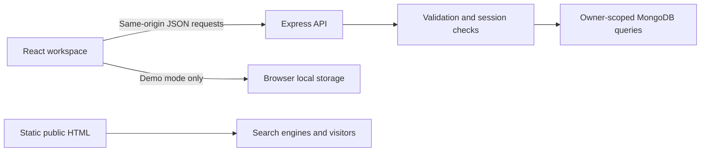

<div align="center">


### A clearer place for projects to move forward.

A MERN project management tool with private accounts, a focused task board, and a no-signup demo.


[Getting started](#getting-started) · [Features](#what-you-can-do) · [Architecture](#how-the-pieces-fit) · [Deployment](#deploy-on-vercel) · [Quality](#quality-and-verification)

</div>

---

## Why Orbit?

A project starts with an idea. Then come the messages, scattered notes, and deadlines that are easy to miss.

**Orbit brings the next steps into one workspace.** Organize tasks by project, choose priorities, keep deadlines visible, and see work move from **To do → In progress → Done**.

Built by **Sheheryar Ahmad**, a Semester 5 Software Engineering student at **COMSATS University Islamabad**.

> **Current release: 0.2.0.** Personal task workspaces with MERN persistence and a separate local demo. Shared team projects, invitations, and live collaboration are future milestones. No production deployment is claimed.

## A look inside


<details>
<summary><strong>See the landing page and mobile workspace</strong></summary>


Screenshots are from the working local demo using illustrative sample tasks.

</details>

## What you can do

| Feature                  | What it solves                                                     |
| ------------------------ | ------------------------------------------------------------------ |
| Private accounts         | Register, sign in, and return to your personal workspace           |
| Task board               | See what is waiting, moving, and finished                          |
| Task editing             | Create, edit, delete, and update status                            |
| Project labels           | Keep tasks organized by project and filter the board               |
| Priorities and deadlines | Make important work and overdue tasks visible                      |
| Search                   | Find tasks by title, description, or project label                 |
| Account-wide overview    | Track total, active, completed, and overdue work                   |
| Bounded pagination       | Browse 30 tasks per page instead of loading everything             |
| Local demo               | Explore without an account; demo data never enters account storage |
| Interface feedback       | Loading skeletons, empty states, save feedback, and error recovery |
| Responsive layout        | Readable layouts on desktop and mobile                             |
| Public pages             | Static marketing content and an honest privacy notice              |

**Scope clarification:** projects currently are labels on tasks. They are not shared project entities with members or permissions.

## Getting started

### Requirements

- **Node.js 20.19+**, with npm
- A local MongoDB server, or a MongoDB Atlas connection
- Git

### 1. Install

```powershell
git clone https://github.com/Sheryar-Ahmad/CodeAlpha_Project-Management-Tool.git
cd CodeAlpha_Project-Management-Tool
npm ci
```

### 2. Configure

```powershell
Copy-Item .env.example .env
```

Edit **.env** locally:

```dotenv
MONGODB_URI=mongodb://127.0.0.1:27017/orbit
APP_ORIGIN=http://127.0.0.1:5173
PORT=3001
```

For Atlas, replace the local URI with your connection string. Never commit that file or paste credentials into source code. Use a dedicated database user and an appropriate Atlas network access list.

### 3. Run

```powershell
npm run dev
```

| Address                               | Purpose                      |
| ------------------------------------- | ---------------------------- |
| http://127.0.0.1:5173/                | Public landing page          |
| http://127.0.0.1:5173/app.html        | Sign in or create an account |
| http://127.0.0.1:5173/app.html?demo=1 | Local demo                   |
| http://127.0.0.1:3001/api/health      | API liveness check           |

Use **127.0.0.1**, matching APP_ORIGIN. Switching to localhost without updating APP_ORIGIN causes mutation requests to be rejected.

The demo works without a database. Account features require MongoDB.

## How the pieces fit



React handles the interactive workspace. Express validates requests and checks authentication. Mongoose defines stored records, and MongoDB persists users, sessions, tasks, and rate-limit counters.

Read [the architecture notes](docs/ARCHITECTURE.md) for the reasoning behind components, cookies, query filters, partial updates, and pagination. See [the API reference](docs/API.md) for endpoints and payload limits.

### Project structure

```text
├── api/                   # Vercel function entry point
├── assets/                # Favicon and README artwork
├── client/
│   ├── components/        # Auth screen, task card, task form
│   ├── hooks/             # Workspace loading and mutations
│   ├── lib/               # API client and isolated demo adapter
│   ├── App.jsx
│   ├── main.jsx
│   └── workspace.css
├── css/                   # Shared public-page and workspace styling
├── docs/                  # Architecture, API, SEO, tests, screenshots
├── public/                # Static crawler configuration
├── scripts/               # SEO generation and browser checks
├── server/
│   ├── config/            # Cached MongoDB connection
│   ├── lib/               # Password hashing, schemas, rate-limit store
│   ├── middleware/        # Authentication and mutation origin checks
│   ├── models/            # User, session, task, rate-limit bucket
│   ├── routes/            # Auth and task endpoints
│   ├── app.js
│   └── index.js
├── shared/                # Calendar validation used by client and server
├── tests/                 # Validation and MongoDB API integration tests
├── app.html               # React workspace entry point; noindex
├── index.html             # Crawlable public landing page
├── privacy.html
├── .env.example
├── package.json
├── package-lock.json
├── vite.config.js
└── vercel.json
```

## Security decisions

- Passwords are salted and hashed with Node’s **scrypt**.
- Sessions use random tokens in **HTTP-only cookies**; only token digests are stored.
- Production cookies use **Secure** and **SameSite=Lax**.
- Every protected query includes the authenticated owner.
- Strict input schemas reject unexpected fields and nested query operators.
- Mutations require an exact trusted Origin, helping prevent cross-site request forgery.
- MongoDB-backed rate-limit counters persist across function instances.
- Task content is rendered as text; no user-controlled HTML is evaluated.
- API responses are marked **no-store**.
- Private environment files, dependencies, build output, and caches are ignored.
- Vercel security headers include a Content Security Policy and framing restrictions.

These measures do not mean the application has undergone an independent security audit. Email verification, password reset, account deletion, and stronger operational abuse controls remain release requirements for broad public adoption. The app trusts Vercel’s direct proxy only when running on Vercel, where forwarding headers are overwritten by the platform. Other reverse-proxy deployments need their own verified configuration.

## Quality and verification

Run the checks:

```powershell
npm run test:unit
npm test
npm run build
npm run format:check
```

**Verified locally:** 17 API/input/password tests and Chromium browser flows covering demo CRUD, storage persistence, search, filters, safe text rendering, mobile overflow, dialog Escape, registration, database-backed task persistence, logout, and login.

For browser checks:

```powershell
$env:PLAYWRIGHT_BROWSERS_PATH = Join-Path $PWD '.cache\playwright'
npx playwright install chromium
npm run test:browser
```

Integration tests use a temporary MongoDB instance, never your production database. On the first run, the test package may download a large MongoDB archive. The test runner puts downloads inside the ignored project cache and can use an existing project-local test server binary.

See [the manual test checklist](docs/TESTING.md). Production hosting, Atlas connectivity, and Search Console checks must still be verified after deployment.

## Deploy on Vercel

1. Import this GitHub repository in Vercel.
2. Use the **Vite** preset, **npm run build**, and **dist** output directory.
3. Add server environment variables:
   - **MONGODB_URI** — database connection; keep secret.
   - **APP_ORIGIN** — exact production origin, e.g. https://your-project.vercel.app.
   - **NODE_ENV=production**.
4. Add **SITE_URL** with the same HTTPS origin for production SEO generation.
5. Configure MongoDB Atlas database-user permissions and network access.
6. Deploy and verify registration, login, task persistence, cookies, /api routing, security headers, and genuine 404 responses.

The frontend calls /api on its own origin. Vercel routes these requests to the Express function; MongoDB connections are reused in warm instances. A preview domain needs its own matching APP_ORIGIN. Canonicals should point only to the chosen production domain.

Do not expose MONGODB_URI through a VITE_ variable. Vite-prefixed values are public browser configuration.

A Supabase heartbeat is not part of this MERN build because it uses MongoDB, not Supabase PostgreSQL.

## SEO approach

Public pages have descriptive titles, descriptions, semantic HTML, crawlable links, useful content, and responsive layouts. The account workspace uses **noindex**.

When SITE_URL is configured, the build generates:

- Consistent absolute canonical URLs.
- Open Graph page URLs.
- WebSite structured data matching Orbit’s visible identity.
- A sitemap containing only public canonical pages.
- A robots.txt sitemap reference.

No fabricated reviews, keyword stuffing, or unsupported ranking claims. A README improves repository understanding and discoverability; website ranking also depends on deployed content, indexing, usefulness, and real performance. See [the SEO launch checklist](docs/SEO.md).

## Next milestones

- [ ] Separate project entities and shared workspace memberships
- [ ] Invitations and role-based authorization
- [ ] Email verification, password reset, and account deletion
- [ ] Activity history and optional live task updates
- [ ] Accessibility audit and measured production performance
- [ ] Live deployment link and LinkedIn walkthrough

Once the core is stable, the strongest optional additions are **activity history**, **real-time shared boards**, and **a polished dark theme**.

## Author and license

**Sheheryar Ahmad**  
Software Engineering · COMSATS University Islamabad  
[GitHub profile](https://github.com/Sheryar-Ahmad) · [Repository](https://github.com/Sheryar-Ahmad/CodeAlpha_Project-Management-Tool)

Copyright © 2026 Sheheryar Ahmad. [MIT License](LICENSE). Copies or substantial portions must retain the copyright and permission notice. See [NOTICE](NOTICE) for attribution.
