<div align="center">

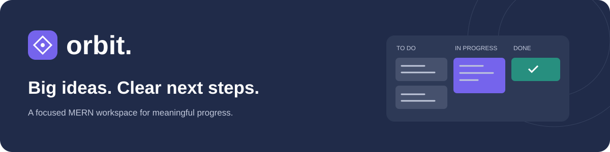

### A clearer place for projects to move forward.

A MERN project management tool for deadlines, clear next steps, and calmer daily work.


[Getting started](#getting-started) · [Features](#what-you-can-do) · [Architecture](#how-the-pieces-fit) · [Deployment](#deploy-on-vercel) · [Quality](#quality-and-verification)

</div>

---

## Why Orbit?

A project starts with an idea. Then come the messages, scattered notes, and deadlines that are easy to miss.

**Orbit brings the next steps into one workspace.** Organize tasks by project, choose priorities, keep deadlines visible, and see work move from **To do → In progress → Done**.

Built by **Sheheryar Ahmad**, a Semester 5 Software Engineering student at **COMSATS University Islamabad**.

> **Current release: 0.5.0.** Personal and explicitly shared project workspaces with invitations, assignments, task discussions, review requests, calendars, milestones, notebooks, weekly work logs, and MERN persistence. Team tasks refresh through polling; email delivery and live sockets are not configured. No production deployment is claimed.

## A look inside

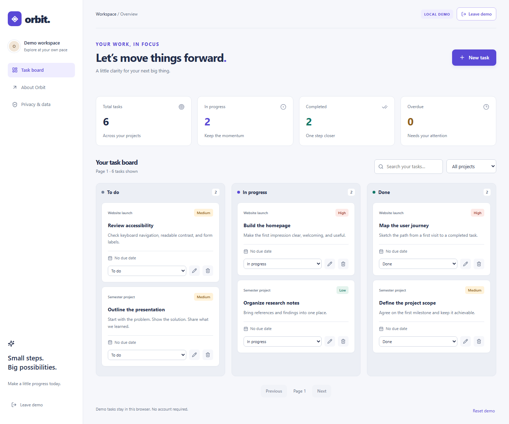

<details>
<summary><strong>See project progress, the focus timer, and mobile layouts</strong></summary>

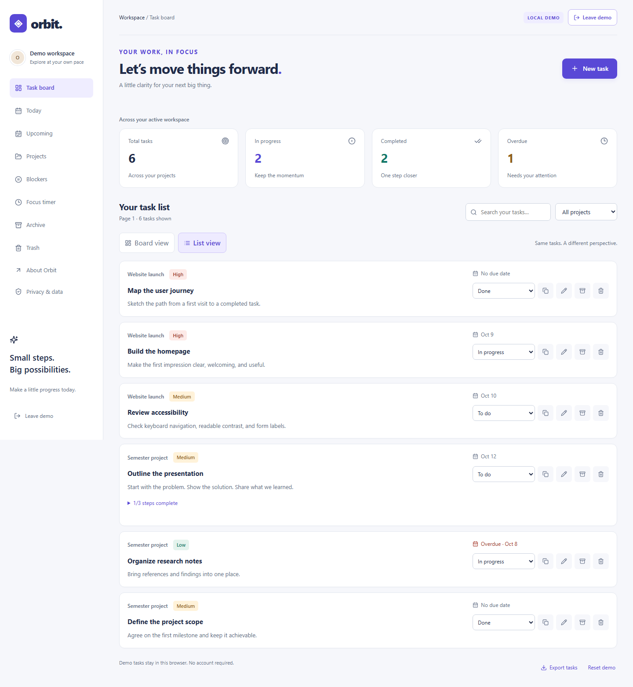

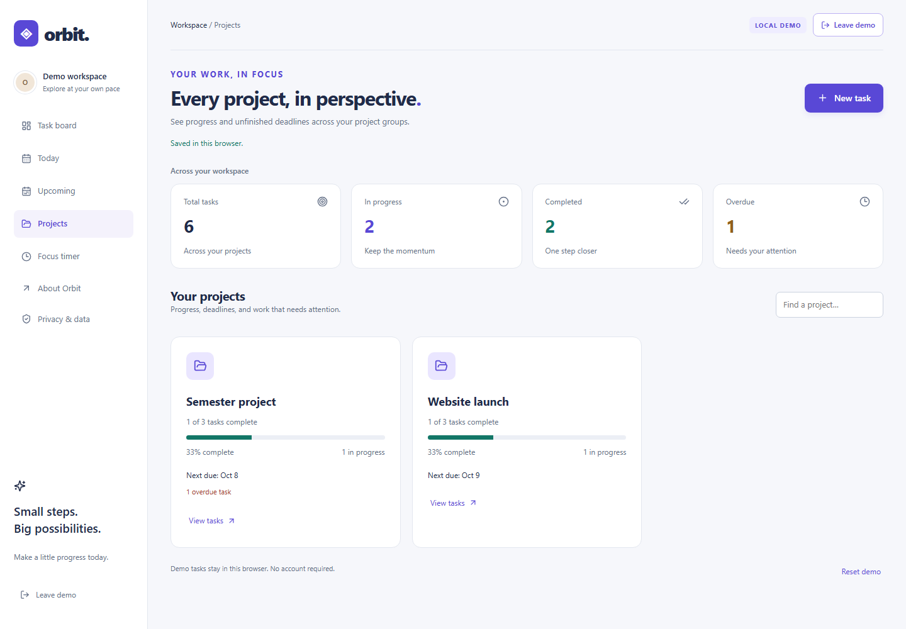

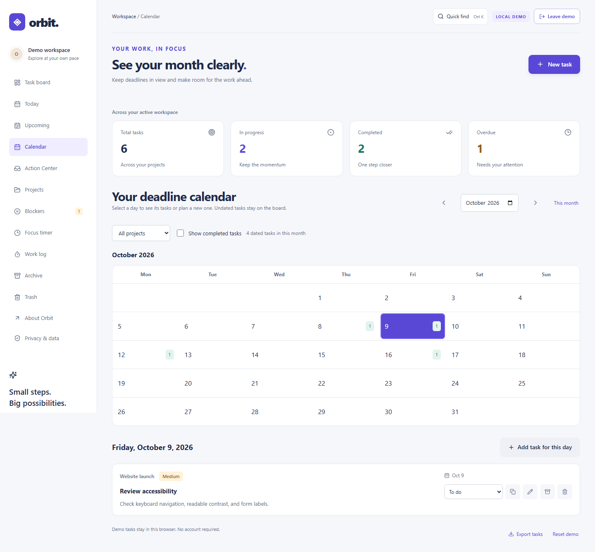

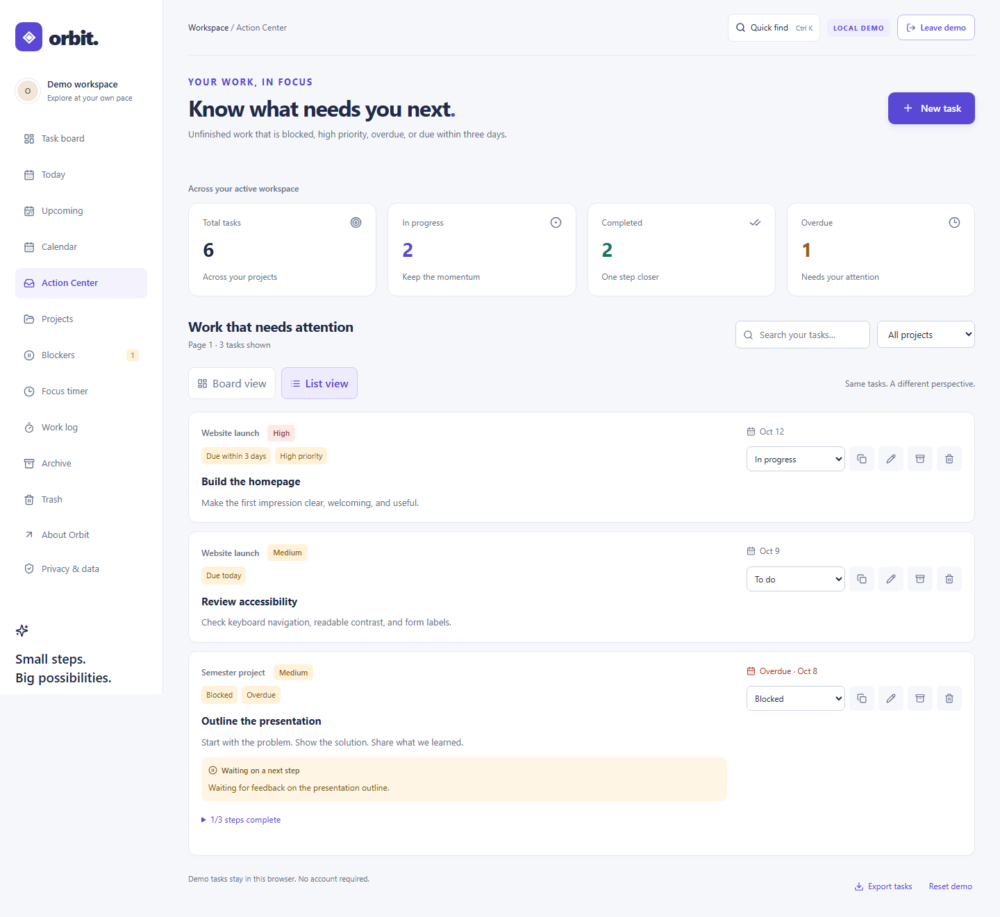

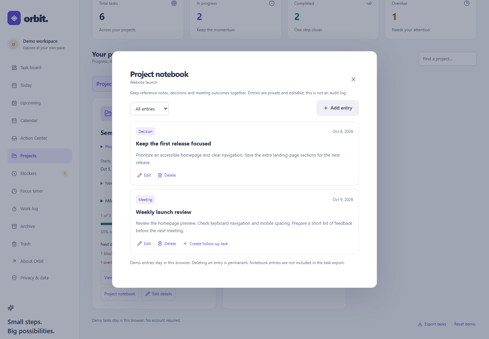

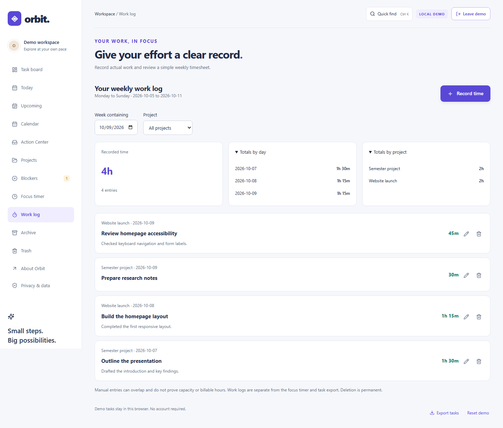

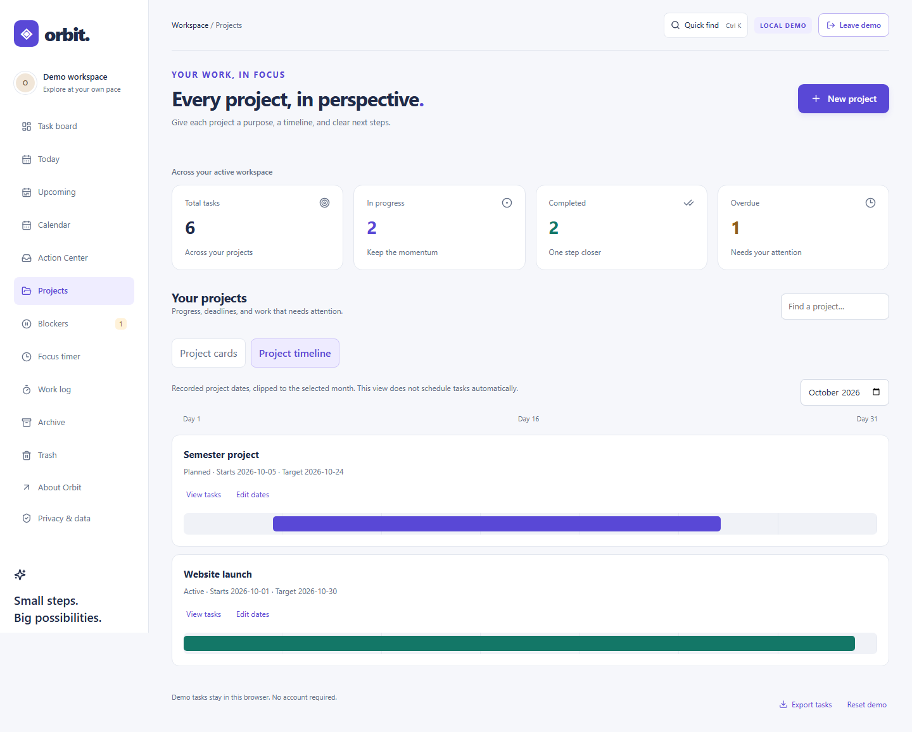

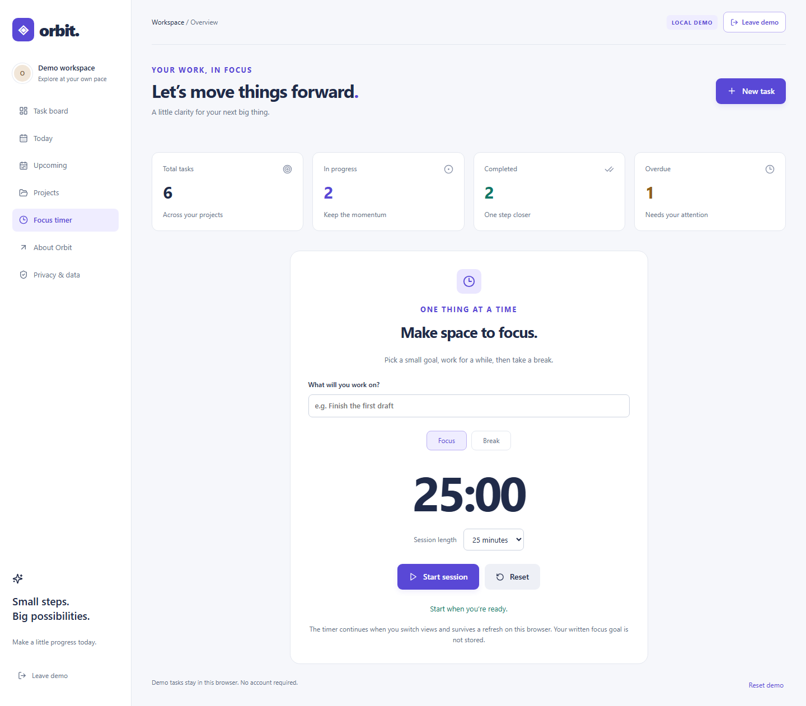

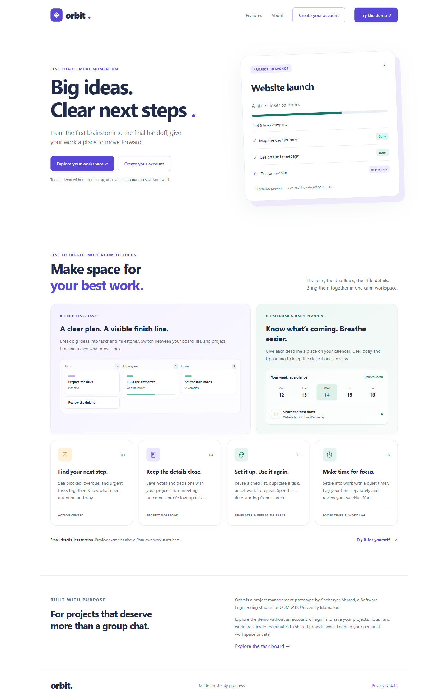

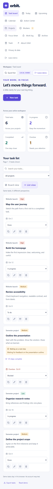

Screenshots are from the working local demo using illustrative sample tasks.

</details>

## What you can do

| Feature                   | What it solves                                                                               |
| ------------------------- | -------------------------------------------------------------------------------------------- |
| Guest portal              | Invite clients to read a project brief, milestones and active-task summaries without editing |
| Work requests             | Propose work for owner triage and accept it into the board without duplicate tasks           |
| Dependencies              | Record prerequisites, reject circular chains, and identify unfinished prerequisites          |
| Team projects             | Invite existing accounts, accept or decline, and remove access without deleting work         |
| Task assignments          | Assign a next step to an accepted teammate and filter your assigned work                     |
| Task discussion           | Keep plain-text comments beside shared tasks, with owner moderation                          |
| Team notes                | Record shared decisions and meetings without exposing private notebooks                      |
| Review requests           | Ask a teammate to review a captured task brief and record approval or changes                |
| Backup import             | Validate a JSON preview and restore into a new owned project without replacing work          |
| Account security          | Password changes, one-time recovery codes and session revocation                             |
| Project templates         | Workshop, launch and research blueprints with previews and retry-safe setup                  |
| Project goals             | Measurable results, transparent progress calculations and stale-edit protection              |
| Workload planning         | Task estimates and weekly project capacity, with unestimated and undated work kept visible   |
| Review inbox              | Find pending reviews addressed to you across accessible projects                             |
| Private accounts          | Register, sign in, and return to your personal workspace                                     |
| Task board                | See what is waiting, moving, and finished                                                    |
| List view                 | Scan the same tasks in a tidy list without losing filters or pagination                      |
| Archive and recovery      | Clear active work, restore tasks from Trash, and confirm permanent deletion separately       |
| Task editing              | Create, edit, move to Trash, and update status                                               |
| Project labels            | Keep tasks organized by project and filter the board                                         |
| Project timeline          | Compare recorded project spans and dated checkpoints within a selected month                 |
| Deadline calendar         | Review a whole month, filter projects, and create/edit tasks from a selected day             |
| Action Center             | Find blocked, overdue, imminent, and high-priority work with clear reasons                   |
| Milestones                | Define up to 20 project checkpoints, dates, and completion states                            |
| Project health            | Explain overdue work, blocked tasks, missed milestones, and planning conflicts               |
| Project notebook          | Keep private project notes, decisions, and meeting outcomes, 20 entries per page             |
| Meeting follow-ups        | Turn a recorded meeting into an editable follow-up task                                      |
| Weekly work logs          | Save manual time entries, correct records, and see totals by day/project                     |
| Quick find                | Navigate views/projects and search all tasks using Ctrl+K or Command+K                       |
| Stable project references | Link new tasks by project ID and explicitly connect older groups                             |
| Project details           | Create projects before tasks; save briefs, start/target dates, and planning status           |
| Priorities and deadlines  | Make important work and overdue tasks visible                                                |
| Today and Upcoming        | Find overdue work, today’s tasks, and the next seven days                                    |
| Blockers                  | Explain what is stuck, review blocked work, and clear reasons when moving forward            |
| Task notes and resources  | Keep decisions and reference links alongside each task                                       |
| Checklists                | Break a task into up to 20 steps and track completion                                        |
| Project overview          | See completion progress and the earliest unfinished deadline                                 |
| Recurring tasks           | Keep completed history and create a fresh daily, weekly, or monthly next occurrence          |
| Task templates            | Start a kickoff, assignment, meeting follow-up, or weekly review with editable steps         |
| Duplicate task            | Reuse a task with fresh steps and a cleared deadline                                         |
| Focus timer               | Work in quiet sessions with pause, break, and refresh recovery                               |
| Search                    | Find tasks by title, description, project, notes, or blocker reason                          |
| Account-wide overview     | Track total, active, completed, and overdue work                                             |
| Bounded pagination        | Browse 30 tasks per page instead of loading everything                                       |
| Task export               | Download a private JSON copy of active, archived, and trashed tasks                          |
| Local demo                | Explore without an account; demo data never enters account storage                           |
| Interface feedback        | Loading skeletons, empty states, save feedback, and error recovery                           |
| Responsive layout         | Readable layouts on desktop and mobile                                                       |
| Public pages              | Static marketing content and an honest privacy notice                                        |

**Scope clarification:** private project records now hold descriptions, dates, and planning status. New tasks receive an owner-scoped project ID. Older tasks remain readable and can be connected through Projects → Connect existing tasks, including archived/trashed records. Names still stay fixed, and summaries use labels during this transition. Team projects now support explicit in-app invitations to existing accounts. Only accepted members can use shared routes, scoped by project ID. Private task views and private notebooks remain separate. Only connected tasks are shared; linking an older group is an explicit owner action.

## Small problems, practical workflows

- **A student with several assignments:** check Today, split a submission into research/draft/review steps, then see the week's deadlines in Upcoming.
- **A freelancer preparing a delivery:** group tasks under the client project, see unfinished deadlines, and duplicate a reusable delivery checklist.
- **Someone organizing a personal project:** keep the next steps visible and use a quiet focus session to make progress.

Checklist completion and task status are separate: finishing the steps leaves you in control of when the whole task is done. Project percentages count completed tasks, not checklist steps. The timer stays in the same browser and does not send your written focus goal to the server.

## Getting started

### Requirements

- **Node.js 20.19+**, with npm
- A local MongoDB server, or a MongoDB Atlas connection
- Git

### 1. Install

```powershell
git clone https://github.com/Sheryar-Ahmad/CodeAlpha_Project-Management-Tool.git
cd CodeAlpha_Project-Management-Tool
npm ci
```

### 2. Configure

```powershell
Copy-Item .env.example .env
```

Edit **.env** locally:

```dotenv
MONGODB_URI=mongodb://127.0.0.1:27017/orbit
APP_ORIGIN=http://127.0.0.1:5173
PORT=3001
```

For Atlas, replace the local URI with your connection string. Never commit that file or paste credentials into source code. Use a dedicated database user and an appropriate Atlas network access list.

### 3. Run

```powershell
npm run dev
```

| Address                               | Purpose                      |
| ------------------------------------- | ---------------------------- |
| http://127.0.0.1:5173/                | Public landing page          |
| http://127.0.0.1:5173/app.html        | Sign in or create an account |
| http://127.0.0.1:5173/app.html?demo=1 | Local demo                   |
| http://127.0.0.1:3001/api/health      | API liveness check           |

Use **127.0.0.1**, matching APP_ORIGIN. Switching to localhost without updating APP_ORIGIN causes mutation requests to be rejected.

The demo works without a database. Account features require MongoDB.

## How the pieces fit

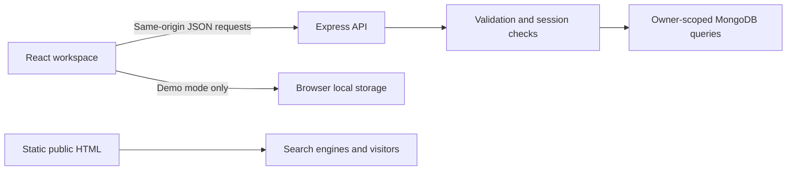

React handles the interactive workspace. Express validates requests and checks authentication. Mongoose defines stored records, and MongoDB persists users, sessions, tasks, private project details/milestones, notebook entries, work logs, project memberships, task comments, review records, and rate-limit counters.

Read [the architecture notes](docs/ARCHITECTURE.md) for the reasoning behind components, cookies, query filters, partial updates, and pagination. See [the API reference](docs/API.md) for endpoints and payload limits.

### Project structure

```text
├── api/                   # Vercel function entry point
├── assets/                # Favicon and README artwork
├── client/
│   ├── components/        # Auth, task forms, projects, focus timer
│   ├── hooks/             # Workspace loading and mutations
│   ├── lib/               # API client, demo adapter, timer helpers
│   ├── App.jsx
│   ├── main.jsx
│   └── workspace.css
├── css/                   # Shared public-page and workspace styling
├── docs/                  # Architecture, API, SEO, tests, screenshots
├── public/                # Static crawler configuration
├── scripts/               # SEO generation and browser checks
├── server/
│   ├── config/            # Cached MongoDB connection
│   ├── lib/               # Password hashing, schemas, rate-limit store
│   ├── middleware/        # Authentication and mutation origin checks
│   ├── models/            # User, session, task, rate-limit bucket
│   ├── routes/            # Auth and task endpoints
│   ├── app.js
│   └── index.js
├── shared/                # Calendar validation and planning rules
├── tests/                 # Validation and MongoDB API integration tests
├── app.html               # React workspace entry point; noindex
├── index.html             # Crawlable public landing page
├── privacy.html
├── .env.example
├── package.json
├── package-lock.json
├── vite.config.js
└── vercel.json
```

## Security decisions

- Passwords are salted and hashed with Node’s **scrypt**.
- Sessions use random tokens in **HTTP-only cookies**; only token digests are stored.
- Production cookies use **Secure** and **SameSite=Lax**.
- Every protected query includes the authenticated owner.
- Strict input schemas reject unexpected fields and nested query operators.
- Mutations require an exact trusted Origin, helping prevent cross-site request forgery.
- MongoDB-backed rate-limit counters persist across function instances.
- Task content is rendered as text; no user-controlled HTML is evaluated.
- API responses are marked **no-store**.
- Private environment files, dependencies, build output, and caches are ignored.
- Vercel security headers include a Content Security Policy and framing restrictions.

These measures do not mean the application has undergone an independent security audit. Email verification, password reset, account deletion, and stronger operational abuse controls remain release requirements for broad public adoption. The app trusts Vercel’s direct proxy only when running on Vercel, where forwarding headers are overwritten by the platform. Other reverse-proxy deployments need their own verified configuration.

## Quality and verification

Run the checks:

```powershell
npm run test:unit
npm test
npm run build
npm run format:check
```

**Verified locally:** 70 API/input/planning/timer/password/template/recovery/export/recurrence/project tests and Chromium browser flows covering demo CRUD, storage persistence, search, filters, safe text rendering, mobile overflow, dialog Escape, checklists, task duplication, template previews and replacement protection, list actions and pagination, blockers, archive/trash restoration, private downloads, daily views, overnight date changes, project progress, focus pause/refresh/completion, registration, database-backed persistence, logout, and login. Expanded checks cover whole-month calendar queries, leap years, Action Center rules, milestones, health explanations, command navigation, notebook decisions/meetings, follow-up drafts, weekly time totals, private APIs, and explicit legacy linking. Team checks cover invitation state transitions, cross-project isolation, removed/pending users, role restrictions, assignment eligibility, private/team note separation, discussion moderation, review decisions and inbox access. Browser tests exercise two separate authenticated accounts and team layouts at 320–1440px.

For browser checks:

```powershell
$env:PLAYWRIGHT_BROWSERS_PATH = Join-Path $PWD '.cache\playwright'
npx playwright install chromium
npm run test:browser
```

Integration tests use a temporary MongoDB instance, never your production database. On the first run, the test package may download a large MongoDB archive. The test runner puts downloads inside the ignored project cache and can use an existing project-local test server binary.

See [the manual test checklist](docs/TESTING.md). Production hosting, Atlas connectivity, and Search Console checks must still be verified after deployment.

## Deploy on Vercel

1. Import this GitHub repository in Vercel.
2. Use the **Vite** preset, **npm run build**, and **dist** output directory.
3. Add server environment variables:
   - **MONGODB_URI** — database connection; keep secret.
   - **APP_ORIGIN** — exact production origin, e.g. https://your-project.vercel.app.
   - **NODE_ENV=production**.
4. Add **SITE_URL** with the same HTTPS origin for production SEO generation.
5. Configure MongoDB Atlas database-user permissions and network access.
6. Deploy and verify registration, login, task persistence, cookies, /api routing, security headers, and genuine 404 responses.

The frontend calls /api on its own origin. Vercel routes these requests to the Express function; MongoDB connections are reused in warm instances. A preview domain needs its own matching APP_ORIGIN. Canonicals should point only to the chosen production domain.

Do not expose MONGODB_URI through a VITE_ variable. Vite-prefixed values are public browser configuration.

A Supabase heartbeat is not part of this MERN build because it uses MongoDB, not Supabase PostgreSQL.

## SEO approach

Public pages have descriptive titles, descriptions, semantic HTML, crawlable links, useful content, and responsive layouts. The account workspace uses **noindex**.

When SITE_URL is configured, the build generates:

- Consistent absolute canonical URLs.
- Open Graph page URLs.
- WebSite structured data matching Orbit’s visible identity.
- A sitemap containing only public canonical pages.
- A robots.txt sitemap reference.

No fabricated reviews, keyword stuffing, or unsupported ranking claims. A README improves repository understanding and discoverability; website ranking also depends on deployed content, indexing, usefulness, and real performance. See [the SEO launch checklist](docs/SEO.md).

## Monetization

No ads are installed in this release. The proposed approach keeps the workspace ad-free and considers a clearly labelled unit on useful public planning content after deployment and AdSense approval. SEO does not guarantee approval or income. Read [the monetization plan](docs/MONETIZATION.md).

### Repeating work without losing history

Choose a due date and Daily, Weekly, or Monthly in the task form. Marking the task Done creates one fresh next occurrence from that due date and preserves the completed record. New steps are unchecked. Monthly schedules retain the original day across short months; changing the due date establishes a new anchor.

There is no background scheduler or automatic catch-up. An overdue completion still advances by one scheduled interval. Archive/Trash do not generate occurrences. To stop repeating, edit the active occurrence and choose Does not repeat. Duplicating a task starts with recurrence off. Dates do not advance beyond 2100-12-31.

### Keep a copy of your work

Use **Export tasks** in the workspace footer to download a JSON file containing your task content, including Archive and Trash. Current search/project filters do not restrict the export. Account exports support up to 1,000 tasks and five requests per hour; an oversized account receives an explicit error instead of a partial file. The local demo supports up to 500 tasks.

The file contains your written task data, so keep it private. It excludes passwords, session tokens, and database credentials. Importing an export is a future feature; the download is not a complete database backup. Project metadata, milestones, notebook entries, and work logs are not included in this task-only export.

## Next milestones

Current work is kept locally without committing or pushing each milestone, as requested. We will commit and push the reviewed changes together.

AI assistance is excluded from the project scope. The remaining roadmap focuses on ordinary MERN workflows, collaboration, planning, and integrations.

See [the product direction review](docs/PRODUCT_DIRECTION.md) for which proposed features fit this release and which require a shared-project architecture first.

- [x] Recurring tasks with completion-driven scheduling rules
- [x] Task notes and useful resource links
- [x] Private task export
- [ ] Validated import for task recovery
- [x] Private project records with briefs, dates, and planning status
- [x] Stable task-to-project references and explicit legacy linking
- [x] Deadline calendar, recorded project timeline, and Action Center
- [x] Milestones and explained project health
- [x] Project notebook, decisions, and meeting follow-ups
- [x] Persisted manual work logs and weekly timesheets
- [x] Keyboard command bar and full-board task search
- [ ] Shared workspace memberships
- [ ] Invitations and role-based authorization
- [ ] Email verification, password reset, and account deletion
- [ ] Activity history and optional live task updates
- [ ] Accessibility audit and measured production performance
- [ ] Live deployment link and LinkedIn walkthrough

The remaining roadmap includes dependency scheduling, public intake forms, automation, account deletion, and configured external integrations. See [the delivery tracker](docs/PRODUCT_DIRECTION.md) for shipped and pending scope; these services are not advertised as complete.

For a short video, use [the 90-second demo outline](docs/DEMO.md).

## Author and license

**Sheheryar Ahmad**  
Software Engineering · COMSATS University Islamabad  
[GitHub profile](https://github.com/Sheryar-Ahmad) · [Repository](https://github.com/Sheryar-Ahmad/CodeAlpha_Project-Management-Tool)

Copyright © 2026 Sheheryar Ahmad. [MIT License](LICENSE). Copies or substantial portions must retain the copyright and permission notice. See [NOTICE](NOTICE) for attribution.

## Working with a team

1. Create two Orbit accounts in separate browser profiles.
2. As the project owner, create a project and open **Team projects**.
3. Select the project, invite the other account’s email, and have that person accept from their Team projects view.
4. Add shared tasks, assign the next step, discuss it, and record team notes. Older tasks must first be connected in Projects.
5. Request a review from another accepted member. The reviewer approves or requests changes; a requester or owner can cancel a pending request.
6. Remove access and verify that the other account can no longer load or update that project.

The owner manages memberships, project details, legacy linking, and permanent deletion. Members can work with shared tasks and their own shared notebook entries/comments; owners can moderate team entries and comments. Directory responses expose names, not account emails or passwords. An invitation is in-app only, not an email message.

Reviews store the task title and description captured at request time. They are feedback records, not file approvals, immutable compliance audit logs, or task completion gates. Later task edits leave the original brief unchanged. Review history is visible to accepted project members, even after the linked task is removed. Recurring successor tasks start unassigned; review records and discussions are not copied into successors or included in task exports.

<details>
<summary><strong>Team workspace previews</strong></summary>

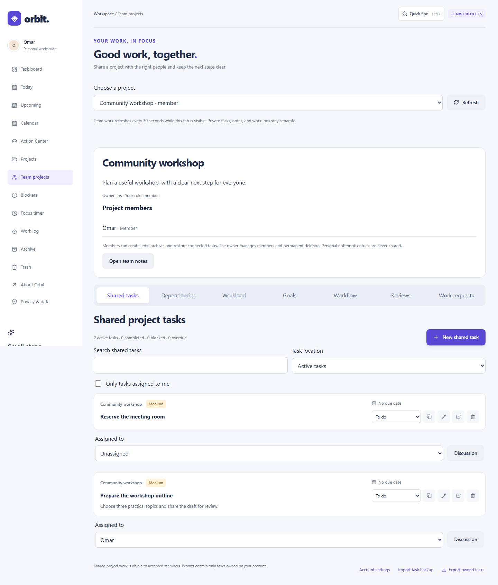

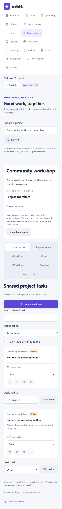

These screenshots use illustrative accounts in an isolated test database.

</details>

Project tools use separate tabs for shared tasks, dependencies, reviews, and work requests. Intake submissions are visible to accepted members; only the owner can accept or decline them. Interrupted acceptance remains visible for a safe retry. Task-only exports exclude intake records.
